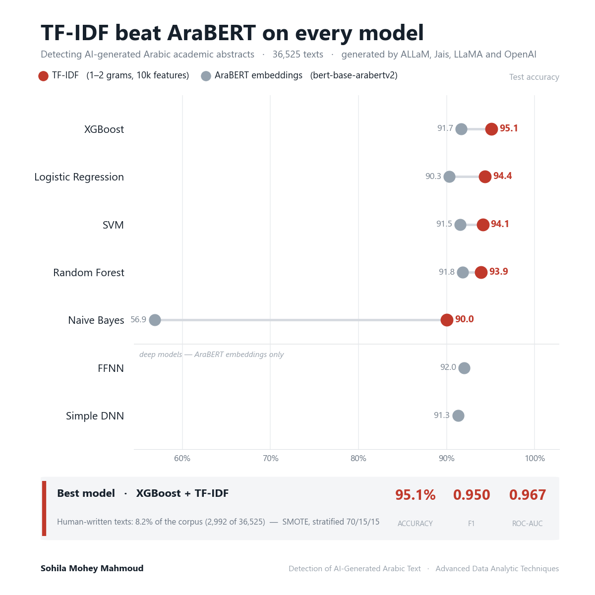

# Detection of AI-Generated Arabic Text

## Project Overview

This project presents an end-to-end pipeline for detecting AI-generated Arabic academic abstracts.

The system combines Arabic-specific text preprocessing, stylometric feature extraction, TF-IDF representations, contextual embeddings, and machine/deep learning models to distinguish between human-written and AI-generated texts.

## Dataset

- Source: Arabic Machine-Generated Text dataset from *The Arabic AI Fingerprint* study.
- Final size after cleaning: 36,525 abstracts.
- Class distribution:
  - Human-written: 2,992 abstracts (8.2%).
  - AI-generated: 33,533 abstracts (91.8%).
- Labels:
  - `1` = Human-written abstract (`original_abstract`).
  - `0` = AI-generated abstract (ALLaM, Jais, LLaMA, and OpenAI).

## Methods

### Preprocessing

- Arabic letter normalization.
- Removal of diacritics, URLs, HTML tags, repeated punctuation, and text noise.
- Tokenization and stopword removal using NLTK and an extended Arabic stopword list.
- ISRI stemming and Stanza lemmatization.
- Saving the processed data as `processed_dataset.csv`.

### Feature Engineering

The extracted stylometric and textual features included:

- Short-word ratio (words containing three letters or fewer).
- Sentence count and structural statistics.
- Foreign-character ratio.
- Repeated n-gram redundancy score.
- Vocabulary richness using the type-token ratio.
- TF-IDF lexical features.
- BERT-based contextual embeddings.

### Modeling

Five classical machine-learning models were evaluated:

- Logistic Regression.
- Naïve Bayes.
- Support Vector Machine.
- Random Forest.
- XGBoost.

Two neural-network architectures were also evaluated:

- Feedforward Neural Network.
- Simple Deep Neural Network.

### Data Splitting and Class Balancing

- Stratified train/validation/test split: 70% / 15% / 15%.
- SMOTE was applied only to the training set to balance the minority human-written class.
- The validation and test sets retained their original class distributions.
- StandardScaler was used to normalize numerical features.

## Results

TF-IDF outperformed BERT embeddings across the classical models evaluated with both representations: Logistic Regression, SVM, and XGBoost.

The best overall configuration was TF-IDF with XGBoost:

- Accuracy: 95.11%.
- F1-score: 0.950.

The strongest BERT-based result was achieved by the Feedforward Neural Network, with an accuracy of 92.01% — still below every classical model trained on TF-IDF.

The stylometric analysis also showed measurable differences between human-written and AI-generated abstracts in sentence structure, redundancy, short-word usage, and vocabulary richness.

### TF-IDF vs BERT Performance



## Repository Structure

```
notebooks/
  1 Phase 1 & 2 .ipynb     Data preparation and Arabic text preprocessing
  2 Phase 3.ipynb          Stylometric feature engineering, TF-IDF and AraBERT embeddings
  3 Phase 4 & 5.ipynb      Model training, evaluation and comparison
scripts/
  data_preparation.py      Loading, cleaning and normalisation helpers
  modeling.py              Training and evaluation routines
  visualization.py         Plotting helpers
  utils.py                 Shared utilities
results/
  figures/                 Word clouds, n-gram plots, lexical analysis, performance charts
  presentations/           Project presentation
docs/                      Full project report (DOCX and PDF)
environment.yml            Conda environment
requirements.txt           pip requirements
```

## Reproducing

```bash
conda env create -f environment.yml
conda activate arabic-abstracts
jupyter lab
```

Then run the notebooks in order. The dataset is not committed to the repository; download
it from the source cited above and place it under `data/`.

## Author

**Sohila Mohey Mahmoud** — Data Analyst
[GitHub](https://github.com/sohilamohey)
